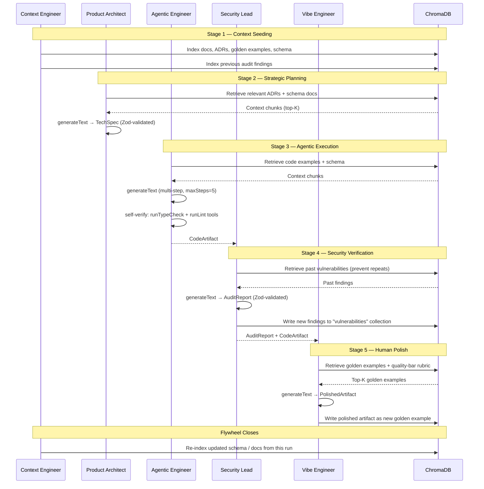

# The Knowledge Flywheel

The flywheel is the core lifecycle of the Agentic Pod. It is not a one-shot pipeline — it is a **closed loop** where every run enriches the knowledge base that future runs draw from.

---

## Sequence Diagram



---

## Stage Details

### Stage 1 — Context Seeding
**Owner:** Context Engineer  
**Code:** `src/core/context/seeder.ts`, `scripts/seed-context.ts`

Crawls `docs/`, `docs/golden-examples/`, and `docs/schema/entities.ts` and upserts them into Chroma. Run once at repo setup (`npm run seed`) and again whenever docs or schema change. CI checks that the seed hash is fresh.

### Stage 2 — Strategic Planning
**Owner:** Product Architect  
**Code:** `src/core/agents/planner.ts`

Receives a plain-English `brief`. Retrieves the top-K chunks from the `plans` and `schema` collections to ground the spec in existing architecture. Outputs a `TechSpec` validated by Zod.

### Stage 3 — Agentic Execution
**Owner:** Agentic Engineer  
**Code:** `src/core/agents/executor.ts`

Receives a `TechSpec`. Uses multi-step agentic loop (`maxSteps: 5`) with code tools (`runTypeCheck`, `runLint`) to self-verify. Retrieves from the `code` collection for golden examples. Outputs a `CodeArtifact`.

### Stage 4 — Security Verification
**Owner:** Security & DX Lead  
**Code:** `src/core/agents/auditor.ts`

Receives a `CodeArtifact`. Retrieves past findings from the `vulnerabilities` collection to avoid repeating known mistakes. Outputs an `AuditReport`. Critically, **writes new findings back to Chroma** — this is how the flywheel accumulates security intelligence over time.

### Stage 5 — Human Polish
**Owner:** Vibe Engineer  
**Code:** `src/core/agents/polisher.ts`

Receives the artifact + audit report. Retrieves the `quality-bar` rubric and golden UX examples. Applies the 5% that agents can't replicate: brand voice, interaction nuance, enterprise feel. Outputs a `PolishedArtifact` and optionally nominates it as a new golden example.

---

## Running the Flywheel

```bash
# Full flywheel with a custom brief
npm run flywheel "Add a user authentication endpoint with JWT and refresh tokens"

# Individual agents (for debugging a specific stage)
npx tsx -e "import('./src/core/agents/planner.ts').then(m => m.planFeature('Add login'))"
```
