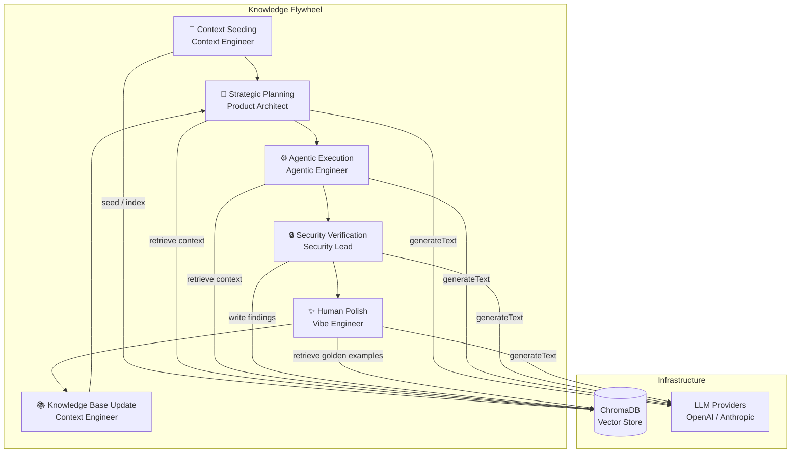

# Architecture Overview

The Agentic Pod OS is a repository template that encodes a five-role "Knowledge Flywheel" as first-class software architecture.
The goal: every commit makes the team's AI agents measurably smarter.

---

## The Five Roles

| Role | Core Mission | Owns |
|------|-------------|------|
| **Product Architect** | Defines *What* and *Why* | `.agentic/roles/product-architect.ts`, `docs/decisions/` |
| **Agentic Engineer** | Executes *How* via AI | `src/core/agents/`, `src/core/flywheel.ts`, `.agentic/tools/` |
| **Context Engineer** | Manages *Memory* | `src/core/context/`, `.agentic/memory/`, `docs/schema/` |
| **Security & DX Lead** | Protects *Process* | `src/core/guardrails/`, `.github/workflows/` |
| **Vibe Engineer** | Refines *Experience* | `.agentic/roles/vibe-engineer.ts`, `docs/architecture/quality-bar.md`, `docs/golden-examples/` |

---

## System Diagram



---

## Directory Map

```
agentic-startup-template/
├── .agentic/
│   ├── memory/           ← ChromaDB adapter (Context Engineer owns)
│   ├── roles/            ← System prompts + model bindings per role
│   └── tools/            ← AI SDK tool() definitions
├── docs/
│   ├── architecture/     ← This file + flywheel sequence + quality bar
│   ├── decisions/        ← ADRs (Agent Impact field on every decision)
│   ├── golden-examples/  ← Ground Truth Library (highest RAG priority)
│   └── schema/           ← Zod entity schemas (the Agent's Map)
├── scripts/
│   ├── evals/            ← LLM evaluation harness
│   └── seed-context.ts   ← Bootstrap the Chroma knowledge base
├── src/
│   └── core/
│       ├── agents/       ← planner, executor, auditor, polisher
│       ├── context/      ← seeder, indexer, retriever
│       ├── guardrails/   ← PII filter, schema validator
│       ├── flywheel.ts   ← Orchestrator (the full lifecycle)
│       └── index.ts      ← Barrel export
└── tests/
    ├── agentic/          ← Integration tests (mock LLM — no API keys)
    └── unit/             ← Fast deterministic unit tests
```

---

## Key Design Principles

1. **Type safety at agent boundaries** — every agent input and output is parsed through a Zod schema. If an LLM returns a malformed response, the guardrail throws before it propagates downstream.

2. **Files as the canonical interface** — agents generate code as `Record<string, string>` (path → content). No in-memory blobs, no opaque objects. The Vibe Engineer can always read, diff, and override the output.

3. **The vector store is the team's memory** — any finding, spec, or golden example that gets written to Chroma is available to every future agent run. The flywheel compiles institutional intelligence, not just features.

4. **Zero real API calls in CI** — `tests/agentic/` uses Vercel AI SDK's `MockLanguageModelV1`. The full flywheel is integration-tested without cost or flakiness.

5. **DX is a guardrail** — Biome, `tsc --noEmit`, and vitest run on every PR. Bad code cannot merge.
